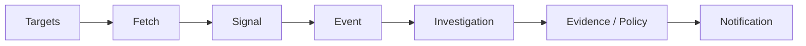

# Web-Watcher

Personal technology change monitoring and research system.

[](https://www.python.org/)

## 功能简介

Web-Watcher 持续监控目标资源，按策略评估变化，并在需要时触发调查与通知。

核心流程：

```
Target
→ Fetch
→ Signal
→ Event
→ Investigation
→ Evidence / Policy
→ Notification
```

它不是爬虫平台、WAF 绕过工具、CAPTCHA 绕过工具或高并发抓取工具。

## 功能特性

* **Web / GitHub 监控** — 通过 CSS/XPath 选择器监控通用网页，并通过 GitHub 官方 API 监控仓库。
* **变更检测** — 内容指纹、ETag/Last-Modified 条件请求与差异评估。
* **持久化状态** — 基于 SQLite 的调度、信号、事件、调查与通知存储。
* **调查与证据** — 符合条件的事件会触发调查；结果和证据会被持久化以供审计。
* **通知** — 至少一次投递，支持 Console、Webhook、Slack、Lark 和 DingTalk。
* **恢复能力** — 防崩溃状态持久化，自动 schema 初始化与过期声明清理。
* **多 Worker 安全** — 通过 SQLite 锁串行化目标声明；重复声明会被拒绝。
* **Docker 部署** — 非 root 用户镜像，挂载 `/data` 和 `/logs` 卷。

## 架构



## 环境要求

* Python >= 3.11
* SQLite 3
* 可选：GitHub Personal Access Token（用于监控 GitHub 仓库）

运行时依赖：

* `requests >= 2.0`
* `pyyaml >= 6.0`

开发依赖：

* `pytest >= 7.0`

## 安装

```bash
python -m pip install --no-deps -e .
```

## 快速开始

```bash
# 运行一次监控流程
python -m web_watcher.cli run --once

# 运行系统自检
python -m web_watcher.cli doctor
```

## 配置

配置文件：`config/watcher.json`

```json
{
  "version": 1,
  "watch_targets": []
}
```

环境变量：

| 变量 | 默认值 | 说明 |
|----------|---------|-------------|
| `WEB_WATCHER_DB` | `web_watcher.db` | SQLite 数据库路径 |
| `WEB_WATCHER_COOLDOWN` | `300` | 默认冷却时间（秒） |
| `WEB_WATCHER_POLL_INTERVAL` | `1.0` | 轮询间隔（秒） |
| `WEB_WATCHER_BATCH_SIZE` | `10` | 事件/通知批次大小 |
| `WEB_WATCHER_MAX_RETRIES` | `3` | 最大重试次数 |
| `WEB_WATCHER_BASE_BACKOFF` | `1.0` | 基础退避时间（秒） |
| `WEB_WATCHER_LOG_LEVEL` | `INFO` | 日志级别 |
| `WEB_WATCHER_WEBHOOK_URL` | — | Webhook 地址 |
| `WEB_WATCHER_RETENTION_MAX_AGE_DAYS` | `30` | 数据保留天数 |
| `WEB_WATCHER_RETENTION_DRY_RUN` | `false` | 保留策略演练模式 |
| `WEB_WATCHER_RULES` | — | 规则文件路径 |
| `GITHUB_TOKEN` | — | GitHub API 令牌 |

## 使用方式

### CLI

```bash
# 单次流程
python -m web_watcher.cli run --once

# 持续守护进程模式
python -m web_watcher.cli daemon --interval 5.0

# 调查 Worker
python -m web_watcher.cli worker --once --batch-size 5

# 通知分发器
python -m web_watcher.cli notify --once --interval 2.0

# 导出审计报告
python -m web_watcher.cli export

# 测试规则文件
python -m web_watcher.cli test-rule path/to/rules.yaml

# 系统自检
python -m web_watcher.cli doctor --verbose
```

### 监控目标

* **通用网页** — CSS/XPath 提取、内容规范化、规范指纹、动态噪声抑制。
* **GitHub API** — 通过官方 API 获取 `releases/latest`、stars 和元数据，支持 ETag + 304。

### 通知渠道

内置渠道：

* Console
* Webhook
* Slack (Block Kit)
* Lark
* DingTalk

## 部署

### Docker

```bash
docker compose up -d
```

健康检查：

```bash
docker compose exec web-watcher python -m web_watcher.cli doctor
```

配置与持久化遵循仓库中的 `docker-compose.yml` 和 `Dockerfile`。

## 可靠性与安全性

### HTTP 语义

| 状态 | 处理方式 |
|--------|----------|
| 200 | 提取、规范化、指纹、差异；可能产生 Signal |
| 304 | 短路；保留 ETag/Last-Modified；不产生 Signal |
| 301/302/307/308 | 记录重定向元数据；不自动跟随 |
| 403 | 禁止；不重试；不产生 Signal |
| 404 | 未找到；不重试；不产生 Signal |
| 429 | 解析 Retry-After；更新 `next_allowed_at`；阶梯式冷却 |
| 5xx / 超时 / DNS 失败 | 增加 `consecutive_failures`；进入退避/冷却 |

### 安全边界

* 不绕过 WAF
* 不绕过 CAPTCHA
* 不伪造 TLS 指纹
* 不为规避目的配置代理轮换
* GitHub 访问仅通过官方 API

### 实现细节

* **确定性抖动** — 退避延迟通过 SHA-256 派生，而非随机数，使同一目标和时间戳下的抖动可复现。
* **声明围栏** — 每个声明都携带唯一的 `claim_token`；过期 Worker 无法修改新 Worker 持有的租约。
* **原子完成** — `finalize_execution()` 在单个事务中完成围栏、目标更新、信号插入、事件创建/更新和链接创建；任何失败都会触发 SQLite 回滚。
* **主机声明租约** — `host_rate_limits` 记录每台主机的声明，支持原子获取和 `claim_until` 过期；崩溃的 Worker 会留下自动过期的租约。
* **过期租约恢复** — `ScheduledRunner.run_once()` 在每次启动时清理过期租约，无需外部 cron 或手动干预。

### 限制

* SQLite 是单节点持久化，非分布式。
* 外部通知是至少一次，非恰好一次。
* GitHub API 速率限制受上游约束。
* 提取失败不意味着删除。
* 无跨进程恰好一次分布式事务。

## 开源范围

本仓库公开发布 Web-Watcher 的可复用软件实现、测试代码、公开文档、配置模板及相关工程组件。

开源仓库与实际生产环境保持清晰分离。

**范围内：** 源代码、测试、公开文档、配置模板、schema、示例数据和 CI/CD 模板。

**范围外：** 令牌、密钥、生产凭据、私有数据、生产日志和基础设施配置。

环境特定配置应通过环境变量或密钥管理提供，而非提交真实凭据。

## 许可证

MIT License. See [LICENSE](LICENSE) for details.
