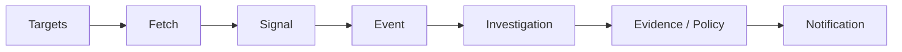

# Web-Watcher

Personal technology change monitoring and research system.

[](https://www.python.org/)

## What It Does

Web-Watcher continuously monitors target resources, evaluates changes according to policy, and triggers investigation and notification when needed.

Core pipeline:

```
Target
→ Fetch
→ Signal
→ Event
→ Investigation
→ Evidence / Policy
→ Notification
```

It is not a crawler platform, WAF bypass tool, CAPTCHA bypass tool, or high-concurrency scraper.

## Features

* **Web / GitHub monitoring** — Generic web pages via CSS/XPath selectors, and GitHub repositories via official API.
* **Change detection** — Content fingerprinting, ETag/Last-Modified conditional requests, and diff evaluation.
* **Persistent state** — SQLite-backed scheduling, signals, events, investigations, and notifications.
* **Investigation & evidence** — Eligible events trigger investigation; results and evidence are persisted for audit.
* **Notifications** — At-least-once delivery via Console, Webhook, Slack, Lark, and DingTalk.
* **Recovery** — Crash-safe state persistence with automatic schema initialization and stale claim cleanup.
* **Multi-worker safety** — Serialized target claiming via SQLite locking; duplicate claims are rejected.
* **Docker deployment** — Production-oriented image with non-root user, volume-mounted `/data` and `/logs`, and graceful shutdown.

## Architecture



## Requirements

* Python >= 3.11
* SQLite 3
* Optional: GitHub Personal Access Token (for monitoring GitHub repositories)

Runtime dependencies (from `pyproject.toml`):

* `requests >= 2.0`
* `pyyaml >= 6.0`

Development dependency:

* `pytest >= 7.0`

## Installation

```bash
python -m pip install --no-deps -e .
```

## Quick Start

```bash
# Run a single monitoring pipeline cycle
python -m web_watcher.cli run --once

# Run system self-check
python -m web_watcher.cli doctor
```

## Configuration

Configuration file: `config/watcher.json`

```json
{
  "version": 1,
  "watch_targets": []
}
```

Environment variables:

| Variable | Default | Description |
|----------|---------|-------------|
| `WEB_WATCHER_DB` | `web_watcher.db` | SQLite database path |
| `WEB_WATCHER_COOLDOWN` | `300` | Default cooldown seconds |
| `WEB_WATCHER_POLL_INTERVAL` | `1.0` | Polling interval seconds |
| `WEB_WATCHER_BATCH_SIZE` | `10` | Batch size for events/notifications |
| `WEB_WATCHER_MAX_RETRIES` | `3` | Maximum retry count |
| `WEB_WATCHER_BASE_BACKOFF` | `1.0` | Base backoff seconds |
| `WEB_WATCHER_LOG_LEVEL` | `INFO` | Logging level |
| `WEB_WATCHER_WEBHOOK_URL` | — | Webhook endpoint |
| `WEB_WATCHER_RETENTION_MAX_AGE_DAYS` | `30` | Data retention days |
| `WEB_WATCHER_RETENTION_DRY_RUN` | `false` | Retention dry run |
| `WEB_WATCHER_RULES` | — | Rules file path |
| `GITHUB_TOKEN` | — | GitHub API token |

## Usage

### CLI

```bash
# Single pipeline cycle
python -m web_watcher.cli run --once

# Continuous daemon mode
python -m web_watcher.cli daemon --interval 5.0

# Investigation worker
python -m web_watcher.cli worker --once --batch-size 5

# Notification dispatcher
python -m web_watcher.cli notify --once --interval 2.0

# Export audit report
python -m web_watcher.cli export

# Test a rule file
python -m web_watcher.cli test-rule path/to/rules.yaml

# System doctor
python -m web_watcher.cli doctor --verbose
```

### Targets

* **Generic Web** — CSS/XPath extraction, content normalization, canonical fingerprint, dynamic noise suppression.
* **GitHub API** — Official API for `releases/latest`, stars, and metadata with ETag + 304 support.

### Notification Channels

Built-in channels:

* Console
* Webhook
* Slack (Block Kit)
* Lark
* DingTalk

## Deployment

### Docker

```bash
docker compose up -d
```

Health check:

```bash
docker compose exec web-watcher python -m web_watcher.cli doctor
```

Configuration and persistence follow the repository `docker-compose.yml` and `Dockerfile`.

## Reliability & Security

### HTTP Semantics

| Status | Handling |
|--------|----------|
| 200 | Extract, normalize, fingerprint, diff; may produce Signal |
| 304 | Short-circuit; retain ETag/Last-Modified; no Signal |
| 301/302/307/308 | Record redirect metadata; do not follow automatically |
| 403 | Forbidden; do not retry; no Signal |
| 404 | Not found; do not retry; no Signal |
| 429 | Parse Retry-After; update `next_allowed_at`;阶梯 cooldown |
| 5xx / timeout / DNS failure | Increment `consecutive_failures`; enter backoff/cooldown |

### Security Boundaries

* No WAF bypass
* No CAPTCHA bypass
* No TLS fingerprint spoofing
* No proxy rotation for evasion
* GitHub access only via official API

### Implementation Details

* **Deterministic jitter** — Backoff delay is derived via SHA-256, not random numbers, making jitter reproducible for the same target and timestamp.
* **Claim fencing** — Every claim carries a unique `claim_token`; stale workers cannot mutate leases held by new workers.
* **Atomic finalization** — `finalize_execution()` completes fencing, target update, signal insert, event create/update, and link create in a single transaction; any failure triggers SQLite rollback.
* **Host claim lease** — `host_rate_limits` records per-host claims with atomic acquire and `claim_until` expiry; crashed workers leave leases that expire automatically.
* **Stale lease recovery** — `ScheduledRunner.run_once()` reaps expired leases on every startup without external cron or manual intervention.

### Limitations

* SQLite is single-node persistence; not distributed.
* External notification is at-least-once, not exactly-once.
* GitHub API rate limits are subject to upstream constraints.
* Extraction failure does not imply deletion.
* No cross-process exactly-once distributed transaction.

## Open Source Scope

This repository publicly releases Web-Watcher's reusable software implementation, test code, public documentation, configuration templates, and related engineering components.

The open source repository maintains a clear separation from actual production environments.

**In scope:** source code, tests, public documentation, configuration templates, schemas, sample data, and CI/CD templates.

**Out of scope:** tokens, keys, production credentials, private data, production logs, and infrastructure configurations.

Environment-specific configuration should be provided via environment variables or secret management, not by committing real credentials.

## License

License information will be added when the repository license file is finalized.
