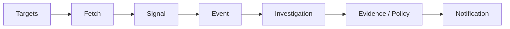

# Web-Watcher

Personal technology change monitoring and research system.

[](https://www.python.org/)

## 功能简介

Web-Watcher 持续监控目标资源，按策略评估变化，并在需要时触发调查与通知。

核心流程：

```
Target
→ Fetch
→ Signal
→ Event
→ Investigation
→ Evidence / Policy
→ Notification
```

它不是爬虫平台、WAF 绕过工具、CAPTCHA 绕过工具或高并发抓取工具。

## 功能特性

* **Web / GitHub 监控** — 通过 CSS/XPath 选择器监控通用网页，并通过 GitHub 官方 API 监控仓库。
* **变更检测** — 内容指纹、ETag/Last-Modified 条件请求与差异评估。
* **持久化状态** — 基于 SQLite 的调度、信号、事件、调查与通知存储。
* **调查与证据** — 符合条件的事件会触发调查；结果和证据会被持久化以供审计。
* **通知** — 至少一次投递，支持 Console、Webhook、Slack、Lark、DingTalk、Email (SMTP)、Telegram (Bot API)、Discord (Webhook)；支持 digest 日报/周报汇总。
* **恢复能力** — 防崩溃状态持久化，自动 schema 初始化与过期声明清理。
* **多 Worker 安全** — 通过 SQLite 锁串行化目标声明；重复声明会被拒绝。
* **Docker 部署** — 非 root 用户镜像，挂载 `/data` 和 `/logs` 卷。
* **监控模板（Preset）** — 内置 `github_release`、`blog_post`、`price`、`product_page`、`news_article`、`status_page`、`changelog` 等预设，可直接生成符合现有规则 schema 的 `rules.yaml`。
* **本地监控台** — `webui` CLI 子命令启动轻量本地监控台，默认仅本机可访问，提供仪表盘、目标列表、事件详情与统计 API。

## 架构



## 环境要求

* Python >= 3.11
* SQLite 3
* 可选：GitHub Personal Access Token（用于监控 GitHub 仓库）

运行时依赖：

* `requests >= 2.0`
* `pyyaml >= 6.0`

开发依赖：

* `pytest >= 7.0`

## 安装

```bash
python -m pip install --no-deps -e .
```

## 快速开始

```bash
# 运行一次监控流程
python -m web_watcher.cli run --once

# 运行系统自检
python -m web_watcher.cli doctor
```

## 配置

配置文件：`config/watcher.json`

```json
{
  "version": 1,
  "watch_targets": []
}
```

环境变量：

| 变量 | 默认值 | 说明 |
|----------|---------|-------------|
| `WEB_WATCHER_DB` | `web_watcher.db` | SQLite 数据库路径 |
| `WEB_WATCHER_COOLDOWN` | `300` | 默认冷却时间（秒） |
| `WEB_WATCHER_POLL_INTERVAL` | `1.0` | 轮询间隔（秒） |
| `WEB_WATCHER_BATCH_SIZE` | `10` | 事件/通知批次大小 |
| `WEB_WATCHER_MAX_RETRIES` | `3` | 最大重试次数 |
| `WEB_WATCHER_BASE_BACKOFF` | `1.0` | 基础退避时间（秒） |
| `WEB_WATCHER_LOG_LEVEL` | `INFO` | 日志级别 |
| `WEB_WATCHER_WEBHOOK_URL` | — | Webhook 地址 |
| `WEB_WATCHER_RETENTION_MAX_AGE_DAYS` | `30` | 数据保留天数 |
| `WEB_WATCHER_RETENTION_DRY_RUN` | `false` | 保留策略演练模式 |
| `WEB_WATCHER_RULES` | — | 规则文件路径 |
| `GITHUB_TOKEN` | — | GitHub API 令牌 |

## 使用方式

### CLI

```bash
# 单次流程
python -m web_watcher.cli run --once

# 持续守护进程模式
python -m web_watcher.cli daemon --interval 5.0

# 调查 Worker
python -m web_watcher.cli worker --once --batch-size 5

# 通知分发器
python -m web_watcher.cli notify --once --interval 2.0

# 导出审计报告
python -m web_watcher.cli export

# 测试规则文件
python -m web_watcher.cli test-rule path/to/rules.yaml

# 系统自检
python -m web_watcher.cli doctor --verbose

# 列出可用监控模板
python -m web_watcher.cli template list

# 查看模板示例
python -m web_watcher.cli template show github_release

# 从模板生成 rules.yaml
python -m web_watcher.cli template apply github_release --url https://github.com/owner/repo
python -m web_watcher.cli template apply blog_post --url https://example.com/blog --selector h1
python -m web_watcher.cli template apply price --url https://example.com/product --selector ".price"
python -m web_watcher.cli template apply product_page --url https://example.com/product/123
python -m web_watcher.cli template apply status_page --url https://status.example.com
python -m web_watcher.cli template apply changelog --url https://github.com/owner/repo/blob/main/CHANGELOG.md
```

### 按标签分组巡检

模板生成的规则自带默认标签，可直接用于分组管理：

```bash
# 查看所有规则及其标签
python -m web_watcher.cli rules list

# 查看所有目标及其标签
python -m web_watcher.cli targets list

# 按标签筛选目标
python -m web_watcher.cli targets list --tag price
python -m web_watcher.cli targets list --tag status --tag ops
```

运行时按标签过滤监控任务：

```bash
# 只巡检带 price 或 ecommerce 标签的目标
python -m web_watcher.cli run --once --include-tags price --include-tags ecommerce

# 排除带 status 标签的目标
python -m web_watcher.cli run --once --exclude-tags status

# 组合使用：先排除，再包含
python -m web_watcher.cli daemon --exclude-tags test --include-tags critical
```

手动编辑 `rules.yaml` 也可添加标签：

```yaml
- id: product_page
  name: Product Monitor
  tags:
    - product
    - price
    - ecommerce
```

### 监控目标

* **通用网页** — CSS/XPath 提取、内容规范化、规范指纹、动态噪声抑制。
* **GitHub API** — 通过官方 API 获取 `releases/latest`、stars 和元数据，支持 ETag + 304。

### 通知渠道

内置渠道：

* Console
* Webhook
* Slack (Block Kit)
* Lark
* DingTalk
* Email (SMTP)
* Telegram (Bot API)
* Discord (Webhook)

## 部署

### Docker

```bash
docker compose up -d
```

健康检查：

```bash
docker compose exec web-watcher python -m web_watcher.cli doctor
```

配置与持久化遵循仓库中的 `docker-compose.yml` 和 `Dockerfile`。

## 可靠性与安全性

### HTTP 语义

| 状态 | 处理方式 |
|--------|----------|
| 200 | 提取、规范化、指纹、差异；可能产生 Signal |
| 304 | 短路；保留 ETag/Last-Modified；不产生 Signal |
| 301/302/307/308 | 记录重定向元数据；不自动跟随 |
| 403 | 禁止；不重试；不产生 Signal |
| 404 | 未找到；不重试；不产生 Signal |
| 429 | 解析 Retry-After；更新 `next_allowed_at`；阶梯式冷却 |
| 5xx / 超时 / DNS 失败 | 增加 `consecutive_failures`；进入退避/冷却 |

### 安全边界

* 不绕过 WAF
* 不绕过 CAPTCHA
* 不伪造 TLS 指纹
* 不为规避目的配置代理轮换
* GitHub 访问仅通过官方 API

### 实现细节

* **确定性抖动** — 退避延迟通过 SHA-256 派生，而非随机数，使同一目标和时间戳下的抖动可复现。
* **声明围栏** — 每个声明都携带唯一的 `claim_token`；过期 Worker 无法修改新 Worker 持有的租约。
* **原子完成** — `finalize_execution()` 在单个事务中完成围栏、目标更新、信号插入、事件创建/更新和链接创建；任何失败都会触发 SQLite 回滚。
* **主机声明租约** — `host_rate_limits` 记录每台主机的声明，支持原子获取和 `claim_until` 过期；崩溃的 Worker 会留下自动过期的租约。
* **过期租约恢复** — `ScheduledRunner.run_once()` 在每次启动时清理过期租约，无需外部 cron 或手动干预。

### 限制

* SQLite 是单节点持久化，非分布式。
* 外部通知是至少一次，非恰好一次。
* GitHub API 速率限制受上游约束。
* 提取失败不意味着删除。
* 无跨进程恰好一次分布式事务。

## 开源范围

本仓库公开发布 Web-Watcher 的可复用软件实现、测试代码、公开文档、配置模板及相关工程组件。

开源仓库与实际生产环境保持清晰分离。

**范围内：** 源代码、测试、公开文档、配置模板、schema、示例数据和 CI/CD 模板。

**范围外：** 令牌、密钥、生产凭据、私有数据、生产日志和基础设施配置。

环境特定配置应通过环境变量或密钥管理提供，而非提交真实凭据。

## 许可证

MIT License. See [LICENSE](LICENSE) for details.

## 更新说明

本次 README 同步更新了 monitoring preset 功能的说明：

- 在「功能特性」中新增 Preset 能力说明。
- 在「CLI 使用方式」中补充 `template` 子命令示例：`list`、`show`、`apply`。

## Release Notes

### v1.0.2 — 2026-08-21

- **Diff Scope v1** — 新增 `scope_selector` 字段，支持 CSS 选择器范围限定；scope miss 明确标记并阻止后续 diff/signal；evidence 保留原始裁剪后文本；`GenericWebTarget` 证据链补充 scope 元信息。
- **Debug / Inspection Mode v1** — 新增 `inspect` CLI 子命令，支持 `--rule` + `--url`/`--html-file`，输出完整 pipeline 链路（fetch → extract → scope → normalize → diff → observation）。
- **Hot Reload v1** — `reload` 子命令支持 `--include-tag` / `--exclude-tag` 过滤；`run --once` 自动检测 rules.yaml 变更并热重载。
- **Rule Registry v1** — 运行时规则启用/禁用/优先级/分组管理，不修改 YAML；`registry` CLI 子命令支持 list/show/enable/disable。
- **Preset Ecosystem v1** — 内置 9 个监控模板（`github_release`、`blog_post`、`price`、`product_page`、`news_article`、`status_page`、`changelog` 等），`template apply` 可直接生成 `rules.yaml`。
- **Target Batch Operations v1** — `targets delete` 支持按标签批量删除，OR 语义；`targets list` 支持 `--tag` / `--require-all-tags` 过滤。
- **Retention / Export Filters v1** — `RetentionManager.enforce()` 支持按 `entity_id`、`event_type`、`importance`、`status`、`channel` 选择性清理；dry-run 零副作用。
- **Notification Retry & Stats v1** — `notify --stats` 输出按状态/渠道聚合的投递统计；`notify --retry` 重试失败通知。
- **GitHub Subresource Isolation v1** — `GitHubTarget` 支持 `watch_types`（releases/stars/tags）子资源状态隔离。
- **Ground Truth** — 全量测试 **1518 passed**；12 项运行时行为验证全部通过。

### v1.0.3 — 2026-08-21

- **Signal Contract 统一** — `GitHubTarget`、`GenericWebTarget`、`RSSFeedTarget` 的 Signal 构造统一为 `value=` + `observed_at=`，移除已弃用的 `payload=` / `created_at=`；异常处理收紧为 `TypeError/ValueError`，避免裸 `except Exception` 吞错。
- **Signal 归一化增强** — `scheduled_runner._normalize_signal` 增加 `observed_at` / `signal_type` / `value` 的兜底解析，dict-based payload 可稳定转为 `Signal`。
- **Fingerprint 持久化** — `GenericWebTarget`、`GitHubTarget`、`RSSFeedTarget` 在创建 `Signal` 时携带确定性 `fingerprint`，支持 `UNIQUE(entity_id, signal_type, fingerprint)` 去重。
- **测试覆盖修正** — signal-based 测试统一通过 `json.loads(sig.value)` 读取 payload；`test_distinct_changes_produce_distinct_fingerprints` 验证 distinct signals 携带 distinct fingerprints。
- **SMTP 密码安全** — `--smtp-password` CLI 参数添加 `DeprecationWarning`，帮助文本明确提示命令行传密码存在泄露风险，推荐使用 `WEB_WATCHER_SMTP_PASSWORD` 环境变量。
- **SQLite 文件权限** — `storage.open_database` 在创建数据库文件后尝试 `chmod 0o600`，降低未授权访问风险。
- **Playwright 版本检测** — `SmartFetcher._fetch_with_playwright` 增加版本探测回退链，避免在部分发行版上因 `__version__` 缺失导致元数据缺失。
- **Ground Truth** — 全量测试 **1518 passed**。

### v1.0.4 — 2026-08-21

- **Digest v1** — 新增 `digest` CLI 子命令，支持 `daily` / `weekly` 预设及自定义 `--since` / `--until` 时间窗口；按 target 汇总事件并生成 Markdown 报告；支持 `--channel console` 直接输出或通过 `webhook` / `email` 渠道派发；`--min-importance` 可过滤只汇总重要以上事件。
- **Ground Truth** — 全量测试 **1531 passed**。

### v1.0.5 — 2026-08-21

- **Telegram / Discord 原生通知** — 新增 `TelegramSender`（Bot API `sendMessage`）与 `DiscordSender`（Webhook Embed）；`notify` 与 `digest` 均支持 `--telegram-bot-token` / `--telegram-chat-id` 与 `--channel discord`；Discord embed 描述自动截断至 4000 字符。
- **通知渠道** — 内置渠道扩展为 Console / Webhook / Slack / Lark / DingTalk / Email / Telegram / Discord。
- **Ground Truth** — 全量测试 **1531 passed**（含 6 个新增 Telegram/Discord 测试）。

### v1.0.6 — 2026-08-21

- **Web UI v1** — 新增 `webui` CLI 子命令，启动轻量本地监控台（默认 `127.0.0.1:8080`）。默认仅本机可访问；如需远程访问，请通过 SSH 隧道或反向代理暴露，不要直接将 `--host 0.0.0.0` 暴露到公网。基于 Python 标准库 `http.server`，零外部依赖；页面包括仪表盘 `/`、目标列表 `/targets`、事件详情 `/events/<id>`；JSON API 包括 `/api/targets`、`/api/events`（分页/过滤）、`/api/events/<id>`（含 signals）、`/api/stats`。
- **Ground Truth** — 全量测试 **1540 passed**（含 9 个新增 Web UI 测试）。
